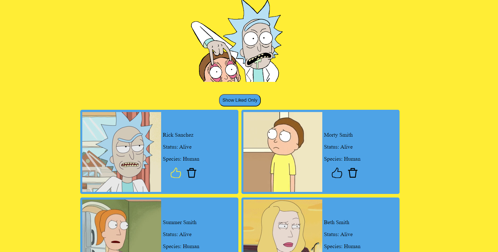

# Rick and Morty Character App

## Overview

The "Rick and Morty Character App" is a web application built using React. It provides users with a visual display of characters from the popular TV show "Rick and Morty". The application fetches character data from the [Rick and Morty API](https://rickandmortyapi.com/).

## Features

1. **View Characters**: See the list of characters with their images and details such as name, status, and species.
2. **Like Characters**: Users can like their favorite characters. Liked characters will have a highlighted icon.
3. **Delete Characters**: If users don't want to see a specific character, they can remove them from the list.
4. **Filter View**: With a single button click, users can toggle the view to show only the characters they've liked.

## Data Source

This application uses the [Rick and Morty API](https://rickandmortyapi.com/) to fetch character details.

## Live Demo

Check out the live demo of the application on [GitHub Pages](https://dinaraknyazeva.github.io/project_cards-from-API/).

## Technologies

&nbsp;
&nbsp;
&nbsp;

## Installation

To run the project locally, follow the steps below:

Clone the repository:.\
1.git clone [https://github.com/DinaraKnyazeva/project_cards-from-API.git](https://github.com/DinaraKnyazeva/project_cards-from-API.git)

### `cd project_cards-from-API`

2.Install the dependencies:

### `npm install`

3.Run the project:

### `npm start`

Open [http://localhost:3000](http://localhost:3000) to view it in your browser.
